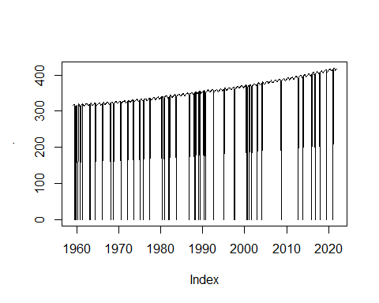
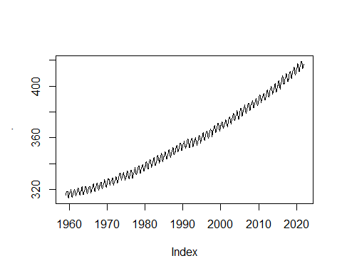
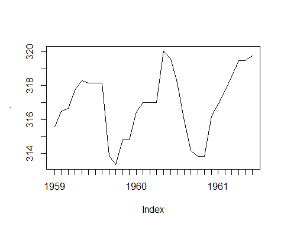
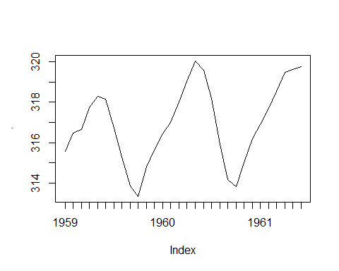

# Lesson 3.4: Imputing Missing Values

## Missing Values

So far, our data has been well-organized, with regularly-spaced time intervals and no missing values. In the real world, however, the quality of data that we work with can sometimes be a little lackluster.

As a quick reminder, many of the time series tools in R, such as the base `ts()` function, are only designed to work with so-called "regular" time series: those without missing values or unevenly-spaced intervals.

In this lesson, we'll go over a few methods for filling in, or "imputing", missing values within a dataset. For this, we'll be working with a modified version of our Mauna Loa CO$_2$ dataset -- you'll notice some of the values are missing! This dataset is loaded as `co2_missing`.


## Imputation

Imputation refers to the process of replacing missing or erroneous data with substituted values, often by taking the average of neighboring values.

Let's look at what an "irregular" time series looks like:


```r
co2_missing %>% 
  plot()
```

<!-- -->

Notice that there are "holes" in the dataset -- perhaps the CO$_2$ sensor was out of order on those days. We can zoom in on a section of the graph to get a better idea of how to fix our data.


```r
co2_missing %>% 
  window(start = as.yearmon("Jan 1985"), end = as.yearmon("Jan 1990")) %>% 
  plot()
```

<!-- -->

A simple, yet effective method of imputation in this case would be to fill in each missing value with the average of its neighbors.


## Imputing with `zoo`

This process is relatively straightforward in R, thanks to the `zoo` package. 

`zoo` has a number of functions designed to work with missing data; let's try a few of them out. We'll go through some of the `na` functions in `zoo` to find which one works best for our case.


## `zoo::na.fill`

The first function we'll use is `na.fill()` which replaces any missing value with a given value. Let's see if this is what we're after:


```r
co2_missing %>%
  zoo::na.fill(0) %>%
  plot()
```

<!-- -->

Ok, clearly it's not; `na.fill` is mostly used on data where there's some sort of "default value" -- maybe number of people living in a certain area or amount of money spent per household on a certain service; the "default" in these cases could probably be zero.


## `na.locf()`

Let's look at another `na` function, `na.locf()`, which stands for "Last Observation Carried Forward". This function finds an `na` value and replaces it with the most recent non-`na` value. What does it look like?


```r
co2_missing %>% 
  zoo::na.locf() %>% 
  plot()
```

<!-- -->

Looks pretty good, right! Let's zoom in a bit further though:

<!-- -->
Those horizontal lines show us what the function is doing; these represent how the Last Observation was "Carried Forward", hence the name of the function.

Let's try one last function to find what we need -- a smooth, accurate approximation of the missing values in our dataset.

## `na.approx`

The `zoo` function `na.approx()` works by linearly interpolating missing values; it simply takes the average of its neighbors. For reference, we also have `na.spline()` which interpolates values with cubic spline interpolation, but I'm only going to show the first function:


```r
co2_missing %>% 
  zoo::na.approx() %>% 
  plot()
```

<!-- -->

This looks pretty good! We can zoom in to see how it performed:

<!-- -->

That looks like a pretty good approximation; it'd be hard to tell that there were missing values in the first place.

Now, go ahead and try some of these functions on your own.
